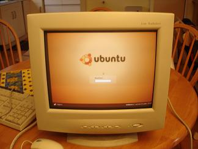

## Une étape cruciale franchie ! 🐧

**Ubuntu a été installé sur tous les PC destinés au lycée de Douentza.**

_Installation en cours du système d'exploitation Ubuntu_

---

## Pourquoi Ubuntu ?

### 🆓 Un choix stratégique et éthique

Ubuntu est une distribution **Linux gratuite et open source** qui offre de nombreux avantages pour notre projet éducatif :

- **💰 Gratuité totale** : Pas de coûts de licences
- **🔒 Sécurité renforcée** : Moins vulnérable aux virus
- **📚 Logiciels éducatifs inclus** : Suite complète préinstallée
- **⚡ Performance optimale** : Fonctionne bien sur du matériel récupéré
- **🌍 Multilingue** : Support du français et d'autres langues

---

## Impact pour le lycée de Douentza

Ces **10 ordinateurs** équipés d'Ubuntu vont permettre aux lycéens d'accéder à :

- 📝 **Traitement de texte** (LibreOffice Writer)
- 📊 **Tableur** (LibreOffice Calc)
- 🎨 **Outils de création** (GIMP, Inkscape)
- 💻 **Programmation** (environnements de développement)
- 🌐 **Navigation internet** (Firefox)

---

## Prochaines étapes

✅ Installation d'Ubuntu : **Terminée !**  
⏳ Tests et configuration : **En cours**  
📦 Emballage et envoi : **À venir en janvier 2007**  
🇲🇱 Arrivée à Douentza : **Février 2007**

> **Le projet informatique avance à grands pas !**
>
> Grâce au travail des bénévoles et au choix de solutions open source, nous allons bientôt pouvoir offrir aux lycéens de Douentza des outils numériques modernes pour leur éducation.

---

_Ubuntu : Un système d'exploitation africain pour une éducation africaine_ 🌍

**Fun fact** : Ubuntu est un mot d'origine bantoue qui signifie "humanité envers les autres" ou "je suis ce que je suis grâce à ce que nous sommes tous". Une philosophie qui correspond parfaitement aux valeurs de Leïdimen ! 💙
