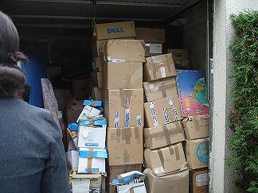
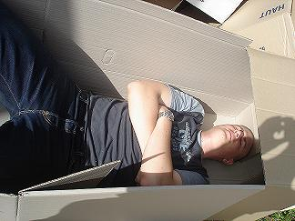

## Une journée de mobilisation collective 📦

Dans le cadre du projet d'**envoi de manuels scolaires et d'ordinateurs au Mali**, des membres de l'association et des bénévoles ont participé à un inventaire le **samedi 30 septembre 2006**.

---

## L'inventaire en action

Une équipe de bénévoles motivés s'est retroussé les manches pour :

- 📚 **Trier les manuels scolaires** collectés
- 💻 **Inventorier les ordinateurs** destinés à Douentza
- 📦 **Organiser le stockage** du matériel
- 🏷️ **Étiqueter les cartons** pour l'envoi

_Nos bénévoles en plein travail d'inventaire_

---

## On a besoin de vous ! 💪

### Rejoignez l'aventure

Si ce genre d'action vous intéresse, **n'hésitez pas à nous en faire part** ! Nous aurons besoin de vous (et surtout de vos bras 😉) la prochaine fois.

### Pourquoi participer ?

- 🤝 **Contribuer concrètement** à un projet solidaire
- 👥 **Rencontrer des gens engagés** et sympathiques
- 💪 **Mettre la main à la pâte** pour l'éducation au Mali
- ☕ **Passer un moment convivial** autour d'un projet commun

---

## Le projet en quelques chiffres

📚 **Centaines de manuels scolaires** collectés  
💻 **10 ordinateurs** en cours de préparation  
👥 **Dizaines de bénévoles** mobilisés  
🇲🇱 **Destination** : Écoles et lycée de la région de Douentza

---

## Prochaines étapes

✅ Collecte des manuels et ordinateurs : **Terminée**  
✅ Inventaire (Acte II) : **Réalisé le 30/09/2006**  
⏳ Installation d'Ubuntu : **En cours**  
📦 Emballage final : **Décembre 2006**  
🚚 Envoi au Mali : **Janvier 2007**

> **L'union fait la force !**
>
> Chaque paire de bras compte dans cette aventure solidaire. Merci à tous les bénévoles qui ont participé à cette journée d'inventaire !

---

## Comment nous rejoindre ?

📧 **Contactez-nous** pour participer aux prochaines actions  
💼 **Aucune compétence spécifique** requise, juste de la bonne volonté  
⏰ **Quelques heures de votre temps** peuvent faire une grande différence

_Ensemble, préparons l'avenir éducatif des jeunes Maliens !_ 🌍✨
