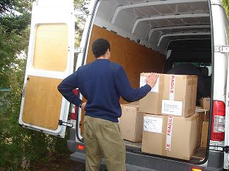
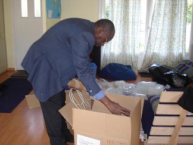
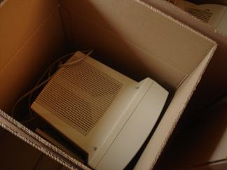
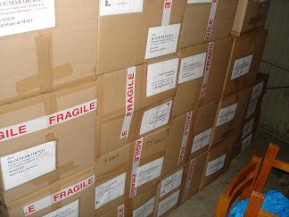

## Un projet majeur qui prend vie ! 💻

Après des semaines de préparation, le grand jour est arrivé : **le matériel informatique est en route vers Bamako** !

_Chargement du matériel informatique direction Bamako_

---

## Les derniers préparatifs

Dans les jours précédents, nos bénévoles ont travaillé d'arrache-pied pour préparer l'envoi des **10 ordinateurs** destinés au lycée de Douentza.

### 📦 Emballage professionnel

Les ordinateurs ont été soigneusement remballés dans des **cartons tout neufs** que nous avons étiquetés pour garantir leur protection durant le transport.

_Emballage minutieux des ordinateurs par nos bénévoles_

---

## Remerciements

> **Encore une fois, merci aux bénévoles !!!!**
>
> Votre investissement et votre engagement permettent de concrétiser ce projet qui va transformer l'enseignement au lycée de Douentza.

---

## Prochaines étapes

Ces 10 ordinateurs vont permettre aux lycéens de Douentza d'accéder aux **technologies de l'information** et de développer des compétences essentielles pour leur avenir.

📍 **Destination finale** : Lycée de Douentza, région de Mopti, Mali 🇲🇱

_Suivez-nous pour connaître l'arrivée du matériel et sa mise en service !_
