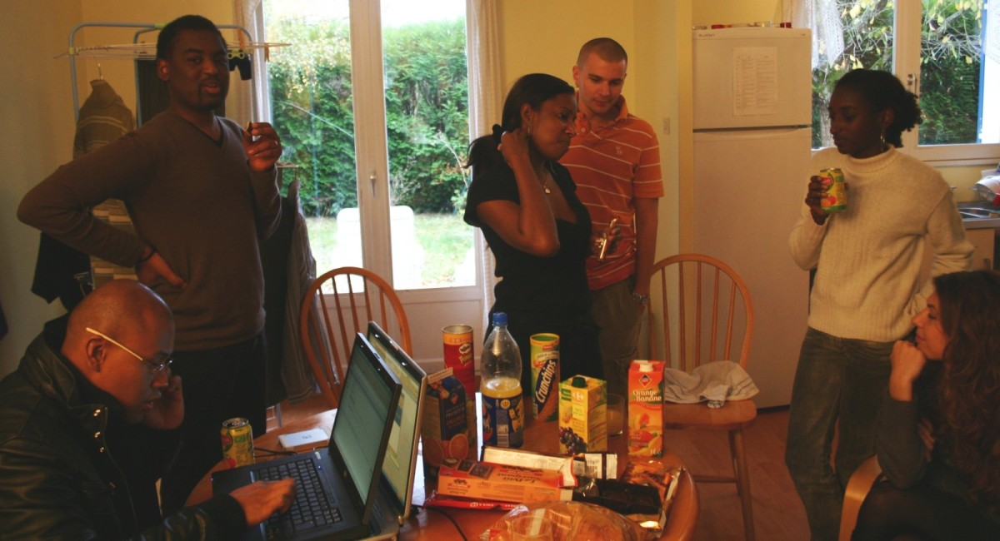
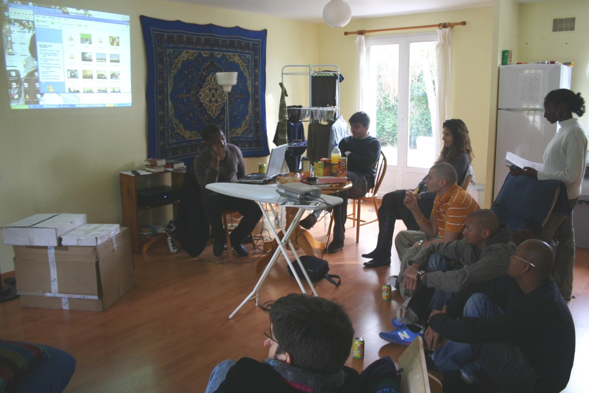

## Une réunion productive

Une réunion s'est tenue **dimanche 28 octobre** à Mennecy.

Une dizaine de membres étaient présents ainsi que deux invités : **Jean-Noël Dor** et **Guillaume Dor**.

## Ordre du jour

1. **Compte-rendu du voyage d'Abdoulaye et Hamassala-David**
2. **État d'avancement des différents projets**
3. **Échange d'idées pour la soirée du samedi 3 mai** sur le thème du Mali
4. **Questions/Réponses**

---

## Prochaines étapes

Une rencontre est prévue **fin novembre** afin de définir d'éventuels objectifs pour les voyageurs du mois de décembre.

### Priorités du Conseil d'Administration

Le CA doit se réunir bientôt pour :

- Effectuer un **bilan financier**
- Prendre des décisions notamment pour la suite des **projets en cours**

### Besoins urgents

Il est important de trouver rapidement des **financements** et de rédiger les **dossiers de subventions**. Des compétences techniques pour établir les budgets sont également recherchées.

---

## Ambiance de la réunion

---

> Merci à tous les participants pour leur engagement et leurs contributions aux discussions !

_Moussa_
