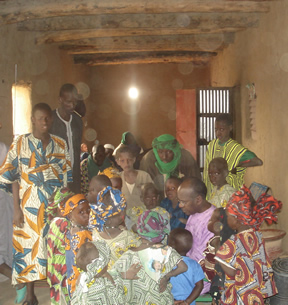
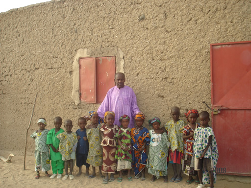
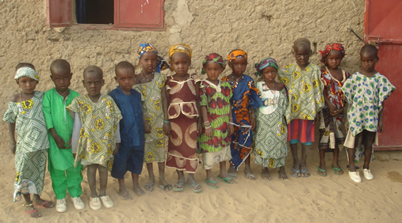
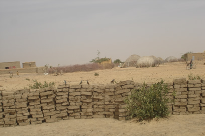
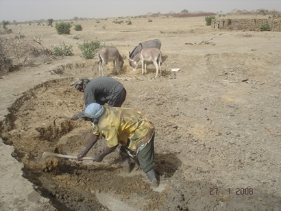
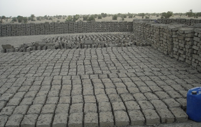
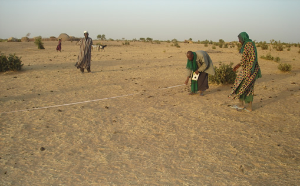
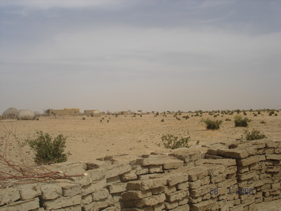

## Un projet qui avance à grands pas

Au mois de décembre, nous vous avons fait part de notre volonté de **construire une école dans le village de Dorool**. Trois mois plus tard, le bilan est très positif !

Mamadou est parti au Mali au mois de janvier. Son voyage a été consacré en grande partie à ce projet, et il est revenu en France avec de très bonnes nouvelles !

## Un accueil enthousiaste des villageois

Les habitants de Dorool ont accueilli le projet avec enthousiasme : **tous les parents veulent inscrire leurs enfants à l'école**, et ce sont les hommes du village eux-mêmes qui construisent la salle de classe.

*Mamadou établissant la liste des futurs élèves*

### Les futurs élèves

Mamadou a établi une liste des futurs élèves. Voici quelques photos de ces enfants pleins d'espoir :

## Le chantier avance rapidement

Le chantier progresse à un rythme soutenu : les hommes construisent actuellement les **briques en banco** avec lesquelles ils bâtiront l'école. La salle de classe devrait être prête pour la rentrée prochaine.

### Photos du chantier

---

## Remerciements

Leïdimen tient à remercier chaleureusement les **donateurs**, qui ont permis à ce projet de démarrer très rapidement. Nous remercions également les **parrains** qui se sont d'ores et déjà engagés à accompagner les enfants de Dorool dans leur scolarité.

> **Les dons et les parrainages sont toujours les bienvenus !**  
> Chaque contribution aide à construire l'avenir éducatif des enfants de Dorool.
